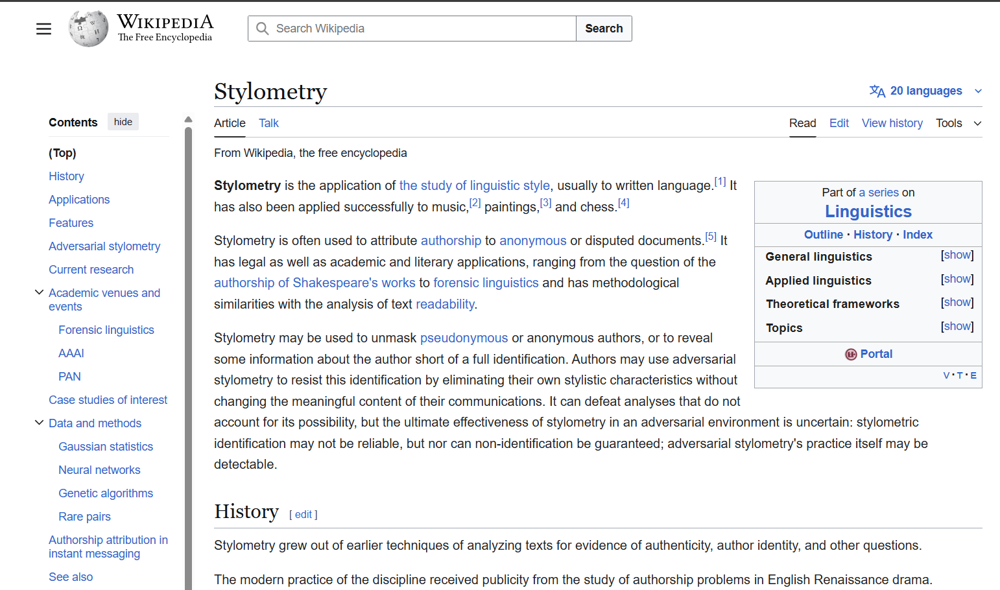
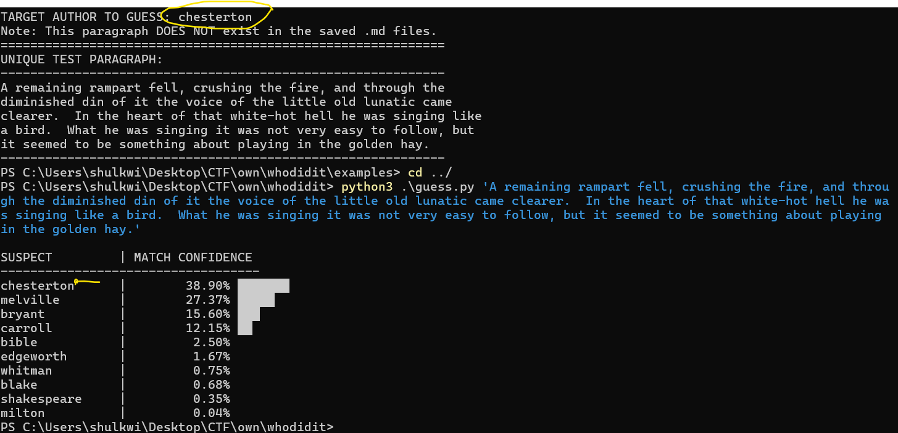

# 🕵️ TextID: Soft Biometrics v6.0
### *The Geometry of Authorial Identity*



## 🎯 At a Glance
**TextID** is a minimalist, high-precision engine for **Soft Biometrics**. It identifies the person behind the text using **Rank-Sync Correlation**. No AI, no cloud—just pure linguistic physics and behavioral DNA.

## 🚀 Proof of Concept
The engine in action, successfully identifying an author from a single unique paragraph:


## ⚡ How it Works!
This is where the magic happens! TextID doesn't just look at words; it analyzes the **subconscious geometry** of your Soft Biometric signature:

1.  **Pulse Capture**: The engine instantly transforms any text into a **70-Dimensional Feature Vector**. It tracks the precise density of "Linguistic Glue" (the words you use without thinking!).
2.  **Rank-Sync Magic**: We use **Cosine Similarity** to measure the mathematical "angle" between two minds. It’s high-speed, high-precision geometry that reveals the "shape" of your writing!
3.  **The Identity Reveal**: By comparing the input signal against our calibrated biometric database, TextID pulls out the true author with surgical accuracy. **The math doesn't lie!** 🧬

## 📂 Quick Start
- feed your documents (at `data` folder)

```bash
# then execute the guss program (hope you gona get it corrcet 😂)
python guess.py "your target text"
```


## challenges
* You can manually collect some users' text and documents (save them in the format at [documents_data_folder](/data/)).
* Another quick option is to generate some challenges using [challenges](/examples/).
* note: you need to make sure to use the `challange||examples` at the root dir of the project 
*Place samples in `data/{author}/` to begin calibration.*
